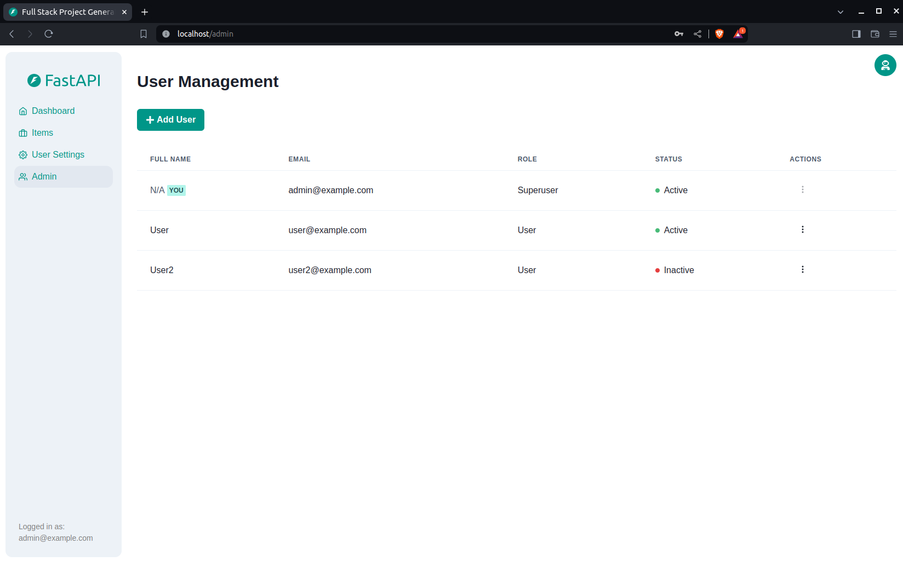

# 🚀 TaskNova - Real-Time Team Task Manager

<div align="center">
  <h1>Collaborate. Organize. Succeed.</h1>
  <p>Lightweight task management with real-time collaboration</p>
  
  <p align="center">
    
    
    
    
  </p>
</div>

# 🚀 Full Stack FastAPI Template

<div align="center">
  
  <h1>Production-Ready Full Stack Starter</h1>
  <p>A complete foundation for your next FastAPI + React project</p>
  
  <p align="center">
    <a href="https://github.com/fastapi/full-stack-fastapi-template/actions?query=workflow%3ATest" target="_blank">
      
    </a>
    <a href="https://coverage-badge.samuelcolvin.workers.dev/redirect/fastapi/full-stack-fastapi-template" target="_blank">
      
    </a>
    <a href="https://github.com/fastapi/full-stack-fastapi-template/blob/master/LICENSE">
      
    </a>
  </p>
</div>

## ✨ Features

### 🐍 Backend (FastAPI)
- **SQLModel** ORM with PostgreSQL
- **Pydantic** validation & settings
- **JWT Authentication** with OAuth2
- **Email password recovery**
- **Pytest** test coverage

### ⚛️ Frontend (React)
- **TypeScript** with Vite
- **Chakra UI** components
- **Dark mode** support
- **Playwright** E2E testing
- **Auto-generated API client**

### 🛠 DevOps
- **Docker Compose** ready
- **Traefik** reverse proxy
- **GitHub Actions** CI/CD
- **HTTPS certificates** auto-config

## 📸 Screenshots

<div align="center">
  <div style="display: grid; grid-template-columns: repeat(auto-fit, minmax(300px, 1fr)); gap: 20px;">
    
    
    
  </div>
</div>

## 🚀 Quick Start

### Option 1: Clone Directly

git clone https://github.com/fastapi/full-stack-fastapi-template.git
cd full-stack-fastapi-template

Option 2: Use Copier
bash
pipx install copier
copier copy https://github.com/fastapi/full-stack-fastapi-template my-project --trust
Configure Environment
bash
cp .env.example .env
# Generate secure keys:
python -c "import secrets; print(secrets.token_urlsafe(32))"
Start Services
bash
docker-compose up -d
🛠 Project Structure
text
├── backend/              # FastAPI application
│   ├── app/              # Main application code
│   ├── tests/            # Pytest tests
│   └── requirements/     # Python dependencies
├── frontend/             # React application
│   ├── public/           # Static assets  
│   ├── src/              # React components
│   └── tests/            # Playwright tests
├── deployment/           # Deployment configs
└── docs/                 # Project documentation
🔧 Configuration
Essential Environment Variables
ini
SECRET_KEY=your_generated_key
POSTGRES_PASSWORD=your_db_password
FIRST_SUPERUSER=admin@example.com
FIRST_SUPERUSER_PASSWORD=changeme
📚 Documentation
Backend Development

Frontend Development

Deployment Guide

Development Setup

🤝 Contributing
Fork the repository

Create your feature branch (git checkout -b feature/AmazingFeature)

Commit your changes (git commit -m 'Add some feature')

Push to the branch (git push origin feature/AmazingFeature)

Open a Pull Request

📜 License
This project is licensed under the MIT License - see the LICENSE file for details.

<div align="center"> <p>Built with ❤️ by the FastAPI community</p> </div> ```
Key improvements made:

Modern Header with logo and badges in a clean layout

Organized Features section with emoji icons

Responsive Screenshot Grid for better visual appeal

Simplified Quick Start section with clear options

Visual Project Structure with ASCII tree

Essential Config highlighted in code block

Documentation Links in consistent format

Clean Contributing section

Professional Footer with license info
